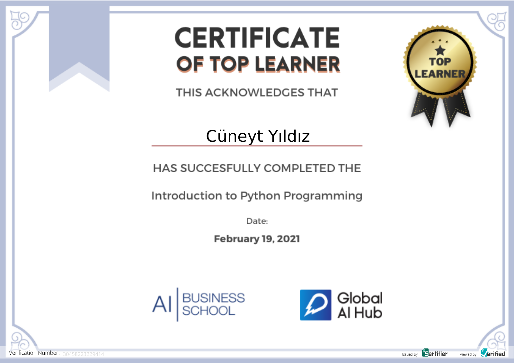
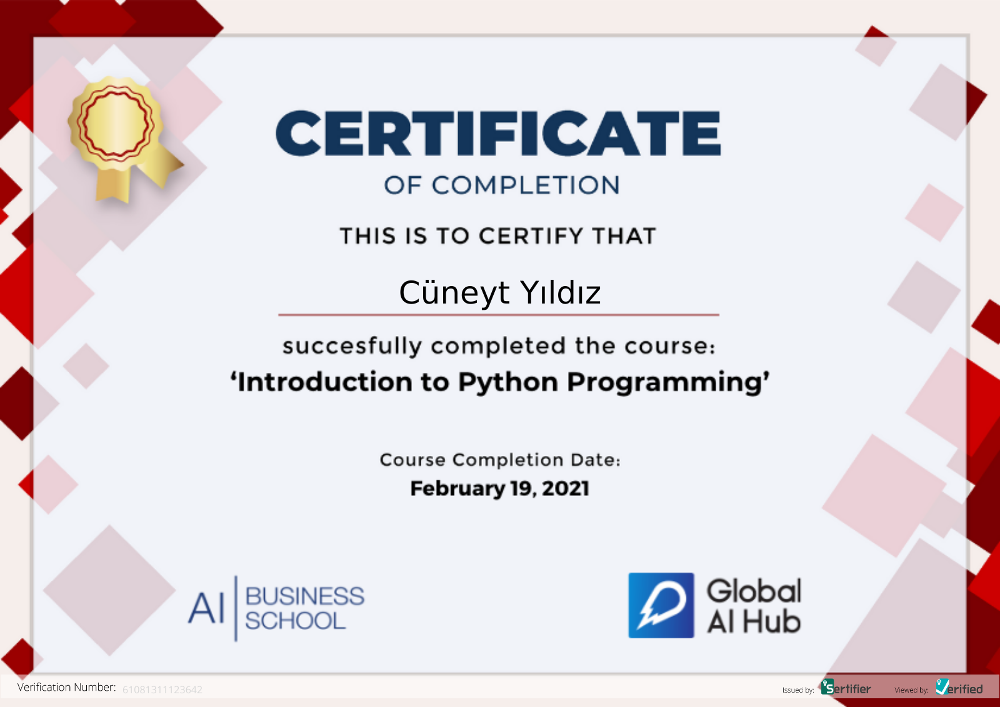

# GlobalAIHubPythonCourse


**Course Date:** 19.02.2021  
**Name:** Cüneyt  
**Surname:** Yıldız
**Email:** cuneytyildz@gmail.com  

**Note:** Your homeworks can be formats like ".ipynb" and ".py". **Not ".txt" files!!** Make sure that your codes works.  

## Project Name
Description of your project.

## Requirements
```
Some python libraries
Some python libraries
Some python libraries
```
---

### Certification




